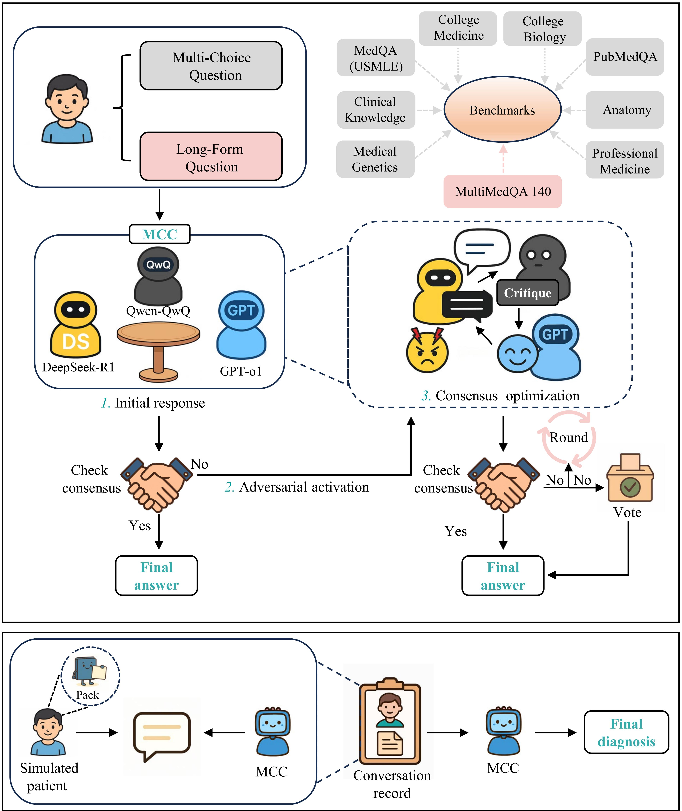

# MCC: Model Confrontation & Collaboration

[](#)
[](#)
[](#)

## 📑 Table of Contents

* [Overview](#-overview)
* [Project Structure](#-project-structure)
* [Installation](#-installation)
* [Configuration](#%EF%B8%8F-configuration)
* [Quick Start](#-quick-start)
* [Benchmarks](#-benchmarks)
* [License](#-license)
* [Logs](#-logs)
* [Citation](#-citation)
* [Contact](#-contact)

---

## 📖 Overview

MCC (Model Confrontation and Collaboration) is a novel debate-based intelligence framework designed to enhance medical reasoning by orchestrating structured debates among multiple advanced LLMs. It integrates critique and self-reflection mechanisms to correct flawed reasoning pathways, leverages the diversity of LLMs to promote epistemic variety, and sustains flexible reasoning through structured, multi-round interactions. MCC is adaptable to a range of core medical tasks, including multiple-choice question answering, long-form medical dialogues, and diagnostic conversations.



---

## 📁 Project Structure

```
MCC/
├── benchmarks/                                       # Benchmark datasets and evaluation data
│   ├── MedQA/                                        # USMLE medical QA
│   │   └── MedQA_test.jsonl                          # Test dataset
│   ├── PubMedQA/                                     # PubMed abstract-based QA
│   │   ├── test_set.json                             # Test dataset
│   │   └── test_ground_truth.json                    # Ground truth answers
│   ├── MMLU_Anatomy/                                 # MMLU Anatomy subset
│   ├── MMLU_Clinical_knowledge/                      # MMLU Clinical Knowledge subset
│   ├── MMLU_College_biology/                         # MMLU College Biology subset
│   ├── MMLU_College_medicine/                        # MMLU College Medicine subset
│   ├── MMLU_Medical_genetics/                        # MMLU Medical Genetics subset
│   ├── MMLU_Professional_medicine/                   # MMLU Professional Medicine subset
│   ├── HealthBench/                                  # HealthBench datasets
│   ├── MedXpertQA/                                   # Expert-level medical QA
│   ├── MetaMedQA/                                    # Metacognitive medical QA
│   ├── MultiMedQA_140/                               # MultiMedQA 140 questions
│   ├── RABBITS/                                      # RABBITS benchmark
│   │   ├── generic_to_brand/                         # Generic to brand name QA
│   │   └── original/                                 # Original RABBITS QA
│   ├── Interactive_OSCE/                             # Interactive OSCE scenarios
│   └── README.md                                     # Benchmark data sources
├── code/                                             # MCC implementation scripts
│   ├── MCC_MedQA.py                                  # MCC for MedQA 
│   ├── MCC_PubmedQA.py                               # MCC for PubMedQA
│   ├── MCC_MMLU_Anatomy.py                           # MCC for MMLU Anatomy
│   ├── MCC_MMLU_Clinical_knowledge.py                # MCC for MMLU Clinical Knowledge
│   ├── MCC_MMLU_College_biology.py                   # MCC for MMLU College Biology
│   ├── MCC_MMLU_College_medicine.py                  # MCC for MMLU College Medicine
│   ├── MCC_MMLU_Medical_genetics.py                  # MCC for MMLU Medical Genetics
│   ├── MCC_MMLU_Professional_medicine.py             # MCC for MMLU Professional Medicine
│   ├── MCC_Henalthbench_function.py                  # HealthBench evaluation
│   ├── MCC_run_HealthBench.py                        # HealthBench runner
│   ├── MCC_generate_report.py                        # Generate summary reports from logs
│   ├── MCC_MedXpertQA.py                             # MCC for MedXpertQA
│   ├── MCC_MetamedQA.py                              # MCC for MetaMedQA
│   ├── MCC_MultiMedQA_140.py                         # MCC for MultiMedQA 140
│   ├── MCC_for_RABBITS__original_MedQA.py            # RABBITS original - MedQA
│   ├── MCC_for_RABBITS__original_MedMCQA.py          # RABBITS original - MedMCQA
│   ├── MCC_for_RABBITS_generic_to_brand_MedQA.py     # RABBITS generic to brand - MedQA
│   ├── MCC_for_RABBITS__generic_to_brand_MedMCQA.py  # RABBITS generic to brand - MedMCQA
│   └── README.md                                     # Code usage instructions
├── logs/                                             # Experiment logs and results
│   ├── MedQA/                                        # MedQA experiment logs
│   ├── PubmedQA/                                     # PubMedQA experiment logs
│   ├── MMLU_*/                                       # MMLU experiment logs
│   └── LFQ/                                          # Long-form QA logs
├── images/                                           # Images for documentation
├── api_config.ini.example                            # API configuration template
├── requirements.txt                                  # Python dependencies
├── LICENSE                                           # MIT License
└── README.md                                         # Main documentation (this file)
```

---

## 💾 Installation

```bash
git clone https://github.com/sunxinti/MCC.git
cd MCC
pip install -r requirements.txt
```

---

## ⚙️ Configuration

### API Setup

Before running any experiments, you need to configure API credentials for the LLM models used in MCC.

#### Step 1: Copy the Configuration Template

```bash
cp api_config.ini.example api_config.ini
```

#### Step 2: Obtain API Keys

MCC requires API access to three LLM providers. Please visit the following links to obtain your API keys:

| Provider | Documentation | Get API Key |
|----------|--------------|-------------|
| **GPT (OpenAI)** | [OpenAI API Docs](https://platform.openai.com/docs/api-reference) | [Get API Key](https://platform.openai.com/api-keys) |
| **Qwen (Alibaba Cloud)** | [Qwen API Docs](https://help.aliyun.com/zh/dashscope/developer-reference/api-details) | [Get API Key](https://dashscope.console.aliyun.com/apiKey) |
| **DeepSeek** | [DeepSeek API Docs](https://api-docs.deepseek.com/) | [Get API Key](https://platform.deepseek.com/api_keys) |

**Alternative API Providers:**
You can also use third-party providers like [ChatAnywhere](https://chatanywhere.apifox.cn/) and [SiliconFlow](https://cloud.siliconflow.cn/models) as alternatives.

#### Step 3: Configure API Credentials

Edit the `api_config.ini` file and fill in your API credentials:

```ini
[GPT]
api_key = your_openai_api_key_here
api_url = https://api.openai.com/v1/chat/completions

[QWEN]
api_key = your_qwen_api_key_here
api_url = your_qwen_api_url_here

[DEEPSEEK]
api_key = your_deepseek_api_key_here
api_url = your_deepseek_api_url_here
```

**Security Note:** The `api_config.ini` file is created locally by copying from the example template and contains your private API keys. Please keep this file secure and never commit it to version control.

**First-time Setup:** When you run MCC for the first time without `api_config.ini`, the system will interactively prompt you to enter API credentials and automatically create the configuration file.

---

## 🚀 Quick Start

### Run MedQA Benchmark

```bash
cd code
python MCC_MedQA.py
```

**Run specific samples or batch processing** (applicable to other benchmarks with same parameters):

```bash
# Process first 3 cases
python MCC_MedQA.py -n 3

# Process 5 cases starting from index 10 (cases 10-14)
python MCC_MedQA.py -n 5 -s 10

# Process single case at index 0
python MCC_MedQA.py -n 1 -s 0
```

**Parameters:**
- `-n`: Number of cases to process
- `-s`: Starting index (optional, default is 0)

### Run PubMedQA Benchmark

```bash
cd code
python MCC_PubmedQA.py
```

### Run MMLU Medical Subsets

```bash
cd code
# Run Anatomy subset
python MCC_MMLU_Anatomy.py

# Run Clinical Knowledge subset
python MCC_MMLU_Clinical_knowledge.py

# Run College Biology subset
python MCC_MMLU_College_biology.py

# Run College Medicine subset
python MCC_MMLU_College_medicine.py

# Run Medical Genetics subset
python MCC_MMLU_Medical_genetics.py

# Run Professional Medicine subset
python MCC_MMLU_Professional_medicine.py
```

### Run MetaMedQA

```bash
cd code
python MCC_MetamedQA.py
```

### Run MedXpertQA

```bash
cd code
python MCC_MedXpertQA.py
```

### Run RABBITS

```bash
cd code
# RABBITS - Original questions (MedQA)
python MCC_for_RABBITS__original_MedQA.py

# RABBITS - Original questions (MedMCQA)
python MCC_for_RABBITS__original_MedMCQA.py

# RABBITS - Generic to brand name conversion (MedQA)
python MCC_for_RABBITS_generic_to_brand_MedQA.py

# RABBITS - Generic to brand name conversion (MedMCQA)
python MCC_for_RABBITS__generic_to_brand_MedMCQA.py
```

### Run MultiMedQA_140

```bash
cd code
python MCC_MultiMedQA_140.py
```

### Run HealthBench

```bash
cd code
# Run all HealthBench subsets (default)
python MCC_run_HealthBench.py

# Run HealthBench Hard subset
python MCC_run_HealthBench.py --subset hard

# Run HealthBench Consensus subset
python MCC_run_HealthBench.py --subset consensus
```

**Parameters:**
- `--subset`: Specify HealthBench subset (`hard` or `consensus`, default runs all subsets)

### Generate Summary Report

After running experiments, you can generate summary reports from the logs for easier review:

```bash
cd code
# For Multiple-Choice Questions (MCQ)
python MCC_generate_report.py --type MCQ logs/MCQ/case_961.txt -o my_mcq_report.txt

# For Long-Form Questions (LFQ)
python MCC_generate_report.py --type LFQ logs/LFQ/Data_S16.txt -o my_lfq_report.txt
```

**Parameters:**
- `--type`: Specify the question type (`MCQ` for multiple-choice questions or `LFQ` for long-form questions)
- Input file: Path to the log file (e.g., `logs/MCQ/case_961.txt`)
- `-o`: Output file name (optional, default generates summary in the same directory)

This script extracts key information from the debate logs and generates concise summaries, making it convenient to review model interactions and reasoning processes.

**Results:** All experiment results will be saved in the corresponding subdirectories under `logs/`.

---

## 📊 Benchmarks

This repository contains multiple medical question answering and reasoning benchmark datasets, located in the `benchmarks/` directory:

### Classical Benchmarks

* **[MedQA](./benchmarks/MedQA)** - USMLE medical exam questions
  * Source: [github.com/jind11/MedQA](https://github.com/jind11/MedQA)

* **[PubMedQA](./benchmarks/PubMedQA)** - Question answering based on PubMed literature abstracts
  * Source: [pubmedqa.github.io](https://pubmedqa.github.io)

#### MMLU Medical Subsets

* **[MMLU_Anatomy](./benchmarks/MMLU_Anatomy)** - Anatomy
* **[MMLU_Clinical_knowledge](./benchmarks/MMLU_Clinical_knowledge)** - Clinical Knowledge
* **[MMLU_College_biology](./benchmarks/MMLU_College_biology)** - College Biology
* **[MMLU_College_medicine](./benchmarks/MMLU_College_medicine)** - College Medicine
* **[MMLU_Medical_genetics](./benchmarks/MMLU_Medical_genetics)** - Medical Genetics
* **[MMLU_Professional_medicine](./benchmarks/MMLU_Professional_medicine)** - Professional Medicine

Source: [Hugging Face - MultiMedQA Collection](https://huggingface.co/collections/openlifescienceai/multimedqa-66098a5b280539974cefe485)

### Next-level Benchmarks: Advanced Reasoning, Metacognition, and Robustness

* **[MedXpertQA](./benchmarks/MedXpertQA)** - Expert-level medical question answering
  * Source: [Hugging Face - TsinghuaC3I/MedXpertQA](https://huggingface.co/datasets/TsinghuaC3I/MedXpertQA)

* **[MetaMedQA](./benchmarks/MetaMedQA)** - Meta medical question answering dataset
  * Source: [Hugging Face - maximegmd/MetaMedQA](https://huggingface.co/datasets/maximegmd/MetaMedQA)

* **[RABBITS](./benchmarks/RABBITS)** - Drug name conversion benchmark
  * Source: [github.com/BittermanLab/RABBITS](https://github.com/BittermanLab/RABBITS)
  * `original/` - Original questions
  * `generic_to_brand/` - Generic to brand name conversion

### Long-form Questions

* **[MultiMedQA_140](./benchmarks/MultiMedQA_140)** - 140 curated medical questions
  * 20 LiveQA questions: [github.com/abachaa/LiveQA_MedicalTask_TREC2017](https://github.com/abachaa/LiveQA_MedicalTask_TREC2017)
  * 20 MedicationQA questions: [github.com/abachaa/Medication_QA_MedInfo2019](https://github.com/abachaa/Medication_QA_MedInfo2019)
  * 100 HealthSearchQA questions: Accessed from the study by Natarajan et al. ([Large language models encode clinical knowledge](https://www.nature.com/articles/s41586-023-06291-2))

* **[HealthBench](./benchmarks/HealthBench)** - Comprehensive health question answering evaluation
  * Source: [github.com/openai/simple-evals](https://github.com/openai/simple-evals)

### Diagnostic Dialogue

* **[Interactive_OSCE](./benchmarks/Interactive_OSCE)** - Interactive clinical skills examination scenarios
  * Source: [UK Federation OSCE Scenarios](https://www.thefederation.uk/sites/default/files/documents/Station%202%20Scenario%20Pack%20(16).pdf)

### Dataset Structure

Each benchmark subdirectory contains test data files in `.json` or `.jsonl` formats.

For detailed data sources and citation information, please refer to the [benchmarks README](./benchmarks/README.md).

---

## 📜 License

This project is open-sourced under the MIT License. See [LICENSE](LICENSE) for details.

---

## 📝 Logs

This directory contains reference logs output by MCC. For detailed stance changes and model interactions, please refer to the supplementary data in our manuscript.

---

## 📚 Citation

If you find MCC useful in your research, please cite our paper:

```bibtex
@article{,
  title={},
  author={},
  journal={},
  volume={},
  number={},
  pages={},
  year={},
  publisher={}
}
```

---

## 📧 Contact

For research collaborations or technical inquiries, please feel free to contact us for any questions or comments:

**Xinti Sun**, E-mail: [sunxinti@tmu.edu.cn](mailto:sunxinti@tmu.edu.cn)

**Erping Long**, E-mail: [erping.long@ibms.pumc.edu.cn](mailto:erping.long@ibms.pumc.edu.cn)

Institute of Basic Medical Sciences, Chinese Academy of Medical Sciences and Peking Union Medical College, Beijing, China

